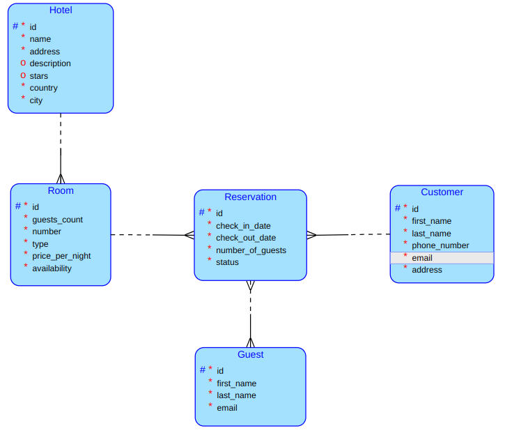

# Hotel reservation
## Run
## Running
- `git clone git@gitlab.fit.cvut.cz:filipleo/stayez-client.git`
- `docker-compose build`
- `docker-compose up`
## Client
https://gitlab.fit.cvut.cz/filipleo/stayez-client
## Description
This semester project involves building a three-tier hotel room reservation application using the Spring framework in Java. It utilizes object-relational mapping (ORM) in the persistent layer and is designed to work with a relational database server capable of handling multiple requests. The project includes at least three entities with CRUD operations, a minimum of one many-to-many relationship, and an additional query, preferably implemented in JPQL. The business logic layer supports all data operations, including CRUD for all entities and many-to-many relationships.

The project emphasizes well-documented REST APIs that expose all business logic layer operations, following web standards, including HTTP status codes and RESTful principles. A complete, structured API documentation, ideally in OpenAPI format, is required, with a recommended practice of using separate Data Transfer Objects (DTOs) for the API.

Automated testing is essential, including three types of tests covered in the course. The project should be efficiently built using Gradle, with tests executed during the build process. Version control using Git and hosting the repository on Gitlab FIT for both development and submission are expected.

## Database Conceptual Model

## Client buisness operation:
**Room Reservation with Enhanced Availability Control:**
- **Description:** This streamlined reservation process is designed for users to easily book a room in a selected hotel. When a client clicks the 'Reserve' button, the system automatically checks if the chosen room is available. If the room is unoccupied, the reservation proceeds; otherwise, the client is notified that the room is unavailable.
- **Steps:** 
    - The client selects a room and enters reservation details and clicks the button.
    - Upon this action, the system instantly checks the current occupancy status of the selected room.
    - If the room is available, reservation is created successfully.
    - If the room is already occupied, the system informs the client and suggests available alternatives.
## Complex query on the server side: 
**Description:** 
We want to get all the reservation that the customer X did in hotel Y and filter it by date.
